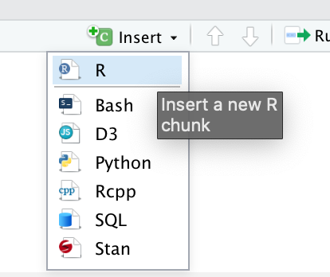
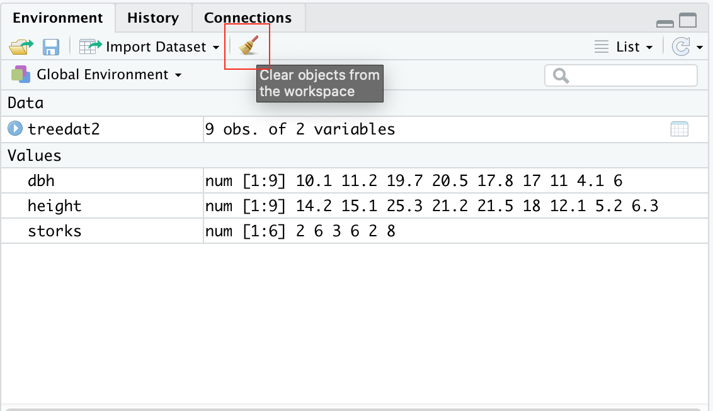

# Basic Operators in R
We will first start by writing codes in an R code chunk (how to insert a code chunk will be covered later in the lecture). Note how the code chunk is shaded grey. Only information that you write in the code chunk is registered as codes. Anything written outside the code chunk, A.K.A the R Markdown chunk, will be registered as non-codes by RStudio. 

Note also how the we have the `#` before the blue text "Basic Operators in R". Having this `#` symbol in the R Markdown chunk tells R that the text should act as a heading. If you want to create a subheading or a sub-subheading, simply add more # symbols in front of the text - for example, ## heading 2 and ### heading 3.

The same `#` symbol has a very different meaning when written in an R code chunk. Anything written after `#` in a code chunk are registered by RStudio as comments and do not run as codes - they are like extra notes that tell you, or someone you share this file to, more information about what the code does.

To learn more about a function, you can place a `?` before the function name (e.g. `?mean`) or search for it directly in the help tab in the bottom right window. This built-in function of R will give you information regarding any code function such as which package it belongs to, its arguments, and examples on how to use it. References and related functions are also provided for your own independent exploration.

As you may have recalled from our synchronous session, you can create vectors with the operator `c()`. To save a vector and assign it to a variable, we use `<-` (the shortcut for this symbol is Alt+-(minus sign) for Windows or Option+-(minus sign) for Mac). R also has other [data types](https://www.statmethods.net/input/datatypes.html) that you can explore on your own time.

```{r}
?mean
x <- c(0:10, 50)
x
# getting help in R
?plot
```


# Running codes
If you want to run a whole code chunk, simply click on the green play button on the top right corner of the R chunk. If you only want to run a single line of code, you can highlight or place your curser on only that line, then click "run" (on the top right corner of the code editor window) and then "run selected lines".


A shortcut for running single code lines is Ctrl+Enter for Windows and Cmd+Return/Enter for Mac. A shortcut for running a whole code chunk is Shift+Ctrl+Enter for Windows and Shift+Cmd+Return/Enter for Mac.

As you can see in the code chunk below, we can also store vectors in variables that are actual words instead of just a single letter. It is noteworthy that variable names need to be 1 single, connected word. For example, `red_apple` is okay, but `red apple` is not! Variable names also cannot start with a number, R is picky this way. For instance, `six_apples` or `apples_6` are okay, but `6_apples` is not!

The function `ls()` is especially helpful if you want to check how many and what variables you've created. Another way to check this is to go to your Environment on the top right corner of RStudio.

```{r cars}
storks <- c(2,6,3,6,2,8)
storks

babies <-c(6,8,5,9,4,9) 
babies

ls()
```

# Insert a new chunk
To insert a new code chunk, you can go to insert and then click R.



Or you can also type this (```{r}```) manually. Note that you can only see the following blank code chunk if you're viewing this file on RStudio.
```{r}
```

# Writing and saving codes
Another data type in R is data frame. You can join several vectors together to create a data frame using the function `data.frame()`. Similarly, you can also save this data frame by storing it in your environment using `<-`. Also, a data frame is similar to a table.

To check all of the names of a data frame's variables, you can use the function `names()`. In this case, a variable is equivalent to a column in a data frame. Pro-tip: if you want to change the names of a data frame's variable/column, you can use the function `names()` followed by `<-` and then a vector of the new names in quotation marks `""`. For example `names(treedat2) <- c("DBH", "Height")` - try it! (But note that you have to turn the names back to its original form for the rest of the codes of this document to work as **R is case-sensitive**)

For now, you are only expected to know that `plot()` is the function that graphs your data. `plot()` needs you to specify the data frame followed by a `$` and then the variable name. The only way to avoid typing the data frame name every time is to use `attach()` - we will go over this function later. There are two ways for you to type your arguments in `plot()`: 

* using ~ to separate the x and y variables and

* using , to separate the x and y variables.

We will explore `plot()` in MUCH more detail in the next module: R II: Graphical Presentation in R.
```{r pressure, echo=FALSE}

# enter the dbh data
dbh <- c(10.1,11.2,19.7,20.5,17.8,17.0,11.0,4.1,6.0)

# enter the height data
height <- c(14.2,15.1,25.3,21.2,21.5,18.0,12.1,5.2,6.3)

# join the vectors above to create a data frame
treedat2 <- data.frame(dbh,height) 

names(treedat2) 
  ## names() gives us all of the variable names of the said dataframe

# simple graph
plot(treedat2$height~treedat2$dbh)

# or plot it as
plot(treedat2$height, treedat2$dbh)
```

### Challenge:
Can you spot any differences between the 2 graphs? How can you change the code of either one of them to make the two match?

# R Important Rules
In this section, we will go over some important rules in R and how to troubleshoot common mistakes.

* Again, it is  important to note that **R is case-sensitive**. In other words, Dbh is VERY different from dbh!!
* There will be times when you need to copy and paste a folder pathway (e.g. when importing a file into R or when setting a new working directory using `setwd()`). If you are using a Mac, R uses / instead of \, so make sure to change all of your \ to / when copying a folder pathway (we will talk more about this later).
* If you are using Windows, R uses \\ instead of \, so make sure to change all of your \ to \\ when copying a folder pathway (we will talk more about this later).
* Everything following # is a comment that does not code for anything.

# Saving the Workspace
You can choose to save the workspace so that RStudio remembers everything that you ran in an earlier session.

# Cleaning up
For the sake of organization, you can choose to clear the workspace - this is especially helpful when your environment is swarmed with unecessary/intermediary variables and dataframes that you don't need. On the top left corner of your environment, there is a broom that you can click to clear your environment.



# Types of Objects
As mentioned earlier, R contains many types of data or types of objects. We have previously covered what a vector is. Once you've created and stored a vector, you can also check its length using `length()` and its class using `class()`. A length of an object is simply how many variables/components it contains. For example `c(1, 2, 3)`'s length is three and `1`'s length is one. The class of an object tells us the type of information an object contains. For example, the class of `c(1, 2, 3)` is numeric whereas the class of `c("male", "female", "other")` is character.

A factor is used to categorize data and can store both strings and integers. You can convert a vector into a factor by using `as.factor()`.

A matrix is a two-dimensional collection of similar data type. You can use `cbind()` (column bind) or `rbind()` (row bind) to bind vectors together into a matrix. A data frame is a more complex table that can contain different types of data. It can be difficult at first to distinguish between a matrix and a dataframe. You can visit this [site](https://www.geeksforgeeks.org/matrix-vs-dataframe-in-r/) to learn more about their differences.

You don't have to know too much about modelling. The main takeaway is that the function `lm()` is used to fit a [linear model](https://www.rdocumentation.org/packages/stats/versions/3.6.2/topics/lm). In other words, the code `lm(v2~v3)` tells R that we want to predict the values of v2 knowing v3 values using a linear model. After creating a model, you can check its structure by using the function `str()`. This function will lets you know all of the parameters and outputs of your model.

The very last function that we will cover in this .Rmd file is `summary()`. This is an extremely powerful function that tells you all of the basic statistics of your object. This includes mean, median, min, max, quartiles, and identify any special values such as NA values.

```{r}
#Examples:
 # Vectors:
v1 <- 1
v2 <- c(1,7.5,2.0)
v3 <- c(1,2,3)
v4 <- c(11,NA,13) # one value is NA (missing)
length(v1)
length(v2)
class(v3)
class(v4)

#Factors:
f1 <- "spaghetti" # called a string-in quotes
f2 <- c("male", "female")
class(f2)

#Change from vector to factor:
f3 <- as.factor(v3) # changes v3 from a vector to a factor
class(f3)

#Matrix:
m1 <- rbind(v2,v3,v4)
dim(m1)
class(m1)

#Dataframe:
df1 <- data.frame(m1,f3) # changes the info to a dataframe
class(df1)

#Model:
model1 <- lm(v2~v3)  
str(model1)   # tells you what is in model1 - lots of stuff

#Summary for basic statistics:  means, percentiles for numeric values, and counts for factors:
summary(v4)
summary(df1)

#More information on the objects: 
str(v4)
str(df1)
```

# Knitting your .Rmd file
In this course, we will only be knitting our .rmd file to a Word or HTML document - preferably Word. Knitting your .Rmd file makes your codes and workflow shareable because not everyone have RStudio installed on their device!